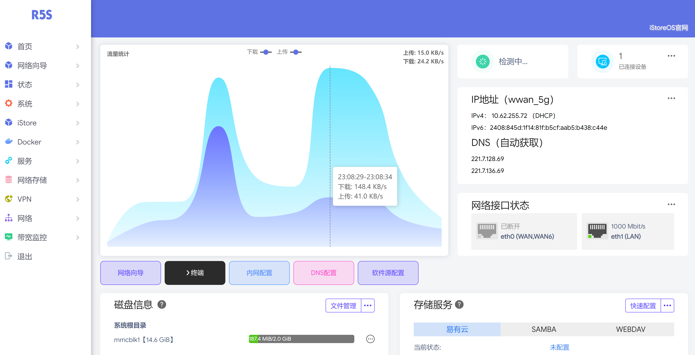
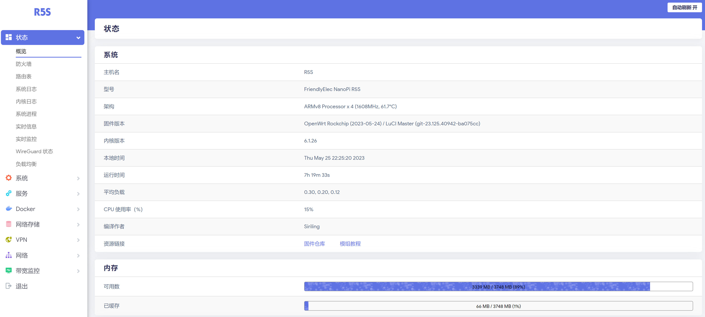
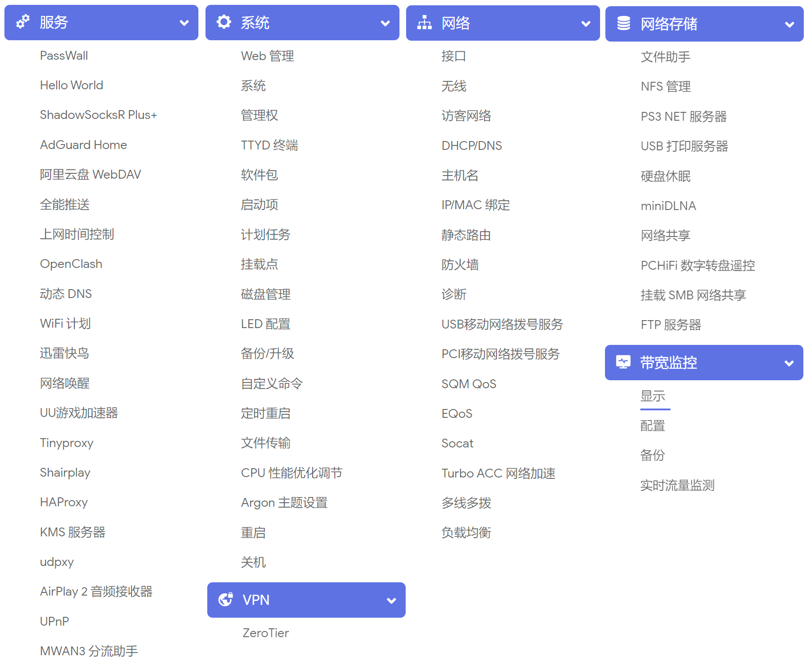

# 中文 | [English](https://github.com/Siriling/NanoPi-R5S-R5C/blob/main/EngLish.md)
# NanoPi-R5S NanoPi-R5C

# 目录

[一、简介](#一简介)

[二、源代码地址 ](#二源代码地址)

[三、固件](#三固件)

[四、资源](#四资源)

[五、展示](#五展示)

[六、鸣谢](#六鸣谢)

# 一、简介

该项目从[DHDAXCW/NanoPi-R5S-R5C](https://github.com/DHDAXCW/NanoPi-R5S-R5C)进行定制，添加5G模块支持和个人定制化

# 二、源代码地址

- lede：https://github.com/DHDAXCW/lede-rockchip
- Luci：https://github.com/DHDAXCW/luci
- packages：https://github.com/DHDAXCW/packages

# 三、固件

## 说明

- 支持网卡MT7921系列
- 完美支持AW7916大功率网卡（minipcie电流要求3a以上才不会掉卡）
- 支持大多数5G模块
- 支持5G模块使用USB或PCIE通信
- 固件已加入5G模组QMI自动拨号脚本（刷写固件后只需要新建接口，开机自动拨号）

## 类型

### 6.x内核

- 完整版（full）：5G支持+短信插件+网卡支持+Docker+多个插件
- 精简版（simplify）：5G支持+短信插件+网卡支持+docker+OpenClash+AD Guardhome等少量常用插件

### 5.x内核

- 特制版（special）：信号插件+5G支持+网卡支持+Docker+OpenClash+AD Guardhome等少量常用插件

## 下载

固件下载地址： https://github.com/Siriling/NanoPi-R5S-R5C/releases

# 四、资源

- 关于r5s刷机方法请参考dn2刷机：[点击查看](https://github.com/DHDAXCW/DoorNet-1-2/blob/mere/emmc.md)
- USB烧录驱动程序：[点击查看](https://github.com/Siriling/NanoPi-R5S-R5C/tree/main/tools/%E9%A9%B1%E5%8A%A8%E7%A8%8B%E5%BA%8F)
- EMMC烧录软件：[点击查看](https://github.com/Siriling/NanoPi-R5S-R5C/tree/main/tools/%E7%83%A7%E5%BD%95%E8%BD%AF%E4%BB%B6)
- 5G模组拨号脚本：[点击查看](https://github.com/Siriling/NanoPi-R5S-R5C/tree/main/tools/5G%E6%A8%A1%E7%BB%84%E6%8B%A8%E5%8F%B7%E8%84%9A%E6%9C%AC)
- 5G模组使用教程：[点击查看](https://blog.siriling.com:1212/2023/03/18/openwrt-5g-modem/)

# 五、展示
## 首页

## 概览

## 插件

## 5G模组接口

# 六、鸣谢

Openwrt 官方项目：

<https://github.com/openwrt/openwrt>

Lean 大的 Openwrt 项目：

<https://github.com/coolsnowwolf/lede>

immortalwrt 的 OpenWrt 项目：

<https://github.com/immortalwrt/immortalwrt>

P3TERX 大佬的 Actions-OpenWrt 项目：

<https://github.com/P3TERX/Actions-OpenWrt>

SuLingGG 大佬的 Actions 编译框架 项目：

https://github.com/SuLingGG/OpenWrt-Rpi
